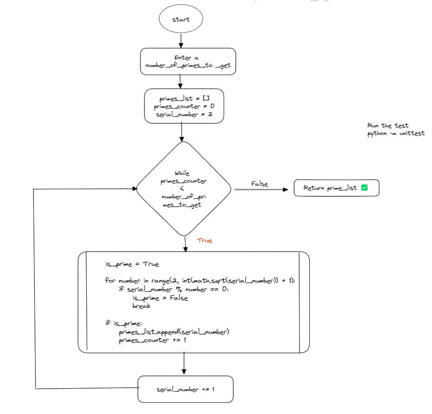

## Challenge: Get prime numbers

Write the function primes such that it receives as a parameter a number n and returns the first n prime numbers.
For example, given n = 6 the function should work like this:

Example:
**primes(6)**
**=> [2, 3, 5, 7, 11, 13]**

# Solution

## Inputs
- Integer number -> 6

## Output
- List of string -> [2, 3, 5, 7, 11, 13]
## Constraints
What is a prime number?
- A prime number is a number greater than 1 that can only be divisible by itself and by one.
- To get a range of prime number I assume to start in the number 2 due to the number 1 does not complete the basic rules of a prime number.
- The function only accept a integer number otherwise raise an error.

## Solution Method
For this solution I used the division test in which we iterate over a series of numbers and get the square of them to create a range from the number to the square part and I use + 1 to this result for an optimal use of the for loop over there.

The condition is if the number is divisible by one of the range created, the number in not a prime number, otherwise is prime.

